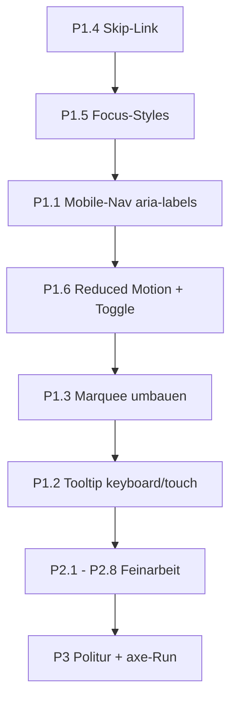

# Accessibility-Audit fuer justiin.de

Bewertet gegen WCAG 2.2 AA, gruppiert nach Prioritaet. Die Seite hat bereits eine solide Grundlage (semantisches `<main>`, `<nav>`, `<section>`-Landmarks, `lang`-Attribut, alt/aria-Labels auf Icons, `target="_blank" rel="noopener noreferrer"`). Die folgenden Punkte schliessen Luecken, die Nutzer mit Screenreader, Tastatur, kognitiven Einschraenkungen, Motion-Sensitivitaet oder Sehschwaeche effektiv aussperren.

---

## Prioritaet 1 - kritische Blocker

### 1.1 Mobile-Navigation ist fuer Screenreader unsichtbar
In [src/components/Navbar.tsx](src/components/Navbar.tsx) wird auf kleinen Screens nur das Icon gerendert:

```96:97:src/components/Navbar.tsx
<span className="relative z-10 hidden sm:block">{item.name}</span>
<span className="relative z-10 sm:hidden">{item.icon}</span>
```

Die Lucide-Icons haben kein `aria-label`, das `<a>` auch nicht. Auf Mobile hoert ein Screenreader-User nur "Link" fuenfmal hintereinander.
- Fix: `aria-label={item.name}` auf dem `<a>` setzen, Icon mit `aria-hidden="true"`.
- `aria-current="page"` auf das aktive Nav-Item (statt nur visuellem State).
- `<nav aria-label="Primaer">` ergaenzen.

### 1.2 Tooltips sind mit Tastatur/Touch unbrauchbar
[src/components/ui/Tooltip.tsx](src/components/ui/Tooltip.tsx) rendert nur bei `onMouseEnter`/`onFocus` auf einem `<div>`, und wrappt ein `SpecBadge` (`<span>`), das gar nicht fokussierbar ist:

```16:22:src/components/ui/Tooltip.tsx
<div 
  className={`relative inline-flex ${className || ""}`}
  onMouseEnter={() => setIsVisible(true)}
  onMouseLeave={() => setIsVisible(false)}
  onFocus={() => setIsVisible(true)}
  onBlur={() => setIsVisible(false)}
>
```
Folge: Tastatur-User und Touch-User sehen nie den Tooltip-Text. Dadurch fehlt Kontext bei allen Services in `Lab`/`Passions` (z. B. Erklaerungen zu "Jellyfin", "Pi-hole", ...).
- Fix: Trigger `tabIndex={0}` + `role="button"` oder besser: `<button>` drumherum. `aria-describedby` auf den Trigger, `id` auf das Tooltip-Element. ESC zum Schliessen. Auch Touch: Tap toggled.

### 1.3 TechStack-Marquee: falsches `aria-hidden` + keine Pause-Kontrolle (WCAG 2.2.2)
[src/components/TechStack.tsx](src/components/TechStack.tsx) markiert den ganzen Marquee als `aria-hidden`, obwohl es echte, tabbare Links enthaelt:

```54:55:src/components/TechStack.tsx
<div className="relative flex overflow-x-hidden group" aria-hidden="true">
  <div className="animate-marquee whitespace-nowrap flex items-center gap-16 py-4">
```
Probleme:
- Screenreader hoeren die gesamte Technologien-Liste nicht.
- Tastatur-User koennen sie trotzdem fokussieren (Tastatur-Falle: Inhalte sind "versteckt" aber fokussierbar - WCAG 4.1.2 Verstoss).
- Unendliche Bewegung > 5s ohne Pause/Stop-Button verletzt WCAG 2.2.2.

Fix:
- `aria-hidden` entfernen und die Liste als `<ul>` auszeichnen (einmalig, nicht dreimal dupliziert).
- Animation via CSS-duplicate fuer die visuelle Schleife; im DOM nur einmal.
- `animation-play-state: paused` bei `:hover`, `:focus-within`, sowie per `prefers-reduced-motion`.
- Optional: sichtbarer Pause-Button.

### 1.4 Kein Skip-Link zur Hauptinhalt (WCAG 2.4.1)
In [src/app/layout.tsx](src/app/layout.tsx) beginnt der Tab-Fokus oben links in der fixierten Navbar. Tastatur-User muessen sich auf jeder Unterseite durch Nav + Theme-Toggle arbeiten.
- Fix: Skip-Link als erstes Element im `<body>`, nur bei Fokus sichtbar, springt zu `<main id="main">`.

### 1.5 Keine sichtbaren Focus-Styles
Im gesamten Projekt gibt es keine `focus-visible:`-Utilities. In Kombination mit glas-transparenten Hintergruenden ist der Browser-Default-Ring oft unsichtbar (z. B. auf der Navbar mit `backdrop-blur` ueber bewegtem Background).
- Fix: Global in [src/app/globals.css](src/app/globals.css) `*:focus-visible` Ring definieren (`outline: 2px solid var(--brand-accent); outline-offset: 2px;`), plus dediziert fuer Links/Buttons/Cards auf transparentem Hintergrund.

### 1.6 Keine `prefers-reduced-motion`-Behandlung (WCAG 2.3.3)
Massiv animiert:
- [src/components/Background.tsx](src/components/Background.tsx): 30 pulsierende Sterne, 4 Shooting Stars, 10 flatternde Voegel endlos.
- [src/components/Hero.tsx](src/components/Hero.tsx): Typing-Effekt + blinkender Cursor.
- [src/components/ui/ScrollProgress.tsx](src/components/ui/ScrollProgress.tsx): spring-animierter Balken.
- Marquee, `animate-pulse` Punkte, Framer-Motion whileInView/whileHover ueberall.

Nutzer mit Migraene/Vestibularstoerungen bekommen aktuell alles ungefragt. Gewaehlt wurde "prefers-reduced-motion + manueller Toggle". Plan:
- Framer-Motion: `<MotionConfig reducedMotion="user">` in der `ThemeProvider`-Ebene - deaktiviert Transforms automatisch.
- Zusaetzlich in globals.css `@media (prefers-reduced-motion: reduce) { .animate-marquee, .animate-pulse, .animate-ping { animation: none !important; } }`.
- Neuer `MotionToggle`-Button (Nachbar des `ThemeToggle`) der in `localStorage` "motion-off" setzt und eine Klasse `.reduce-motion` auf `<html>` togglet. Die gleichen CSS-Overrides greifen dann unabhaengig vom OS-Setting.
- `Background`-Komponente bei Reduced Motion komplett ausblenden oder statisches Bild anzeigen.
- `Hero`-Typing-Effekt bei Reduced Motion sofort den vollen Text setzen (aktuell staendige DOM-Aenderung = Screenreader-Spam, siehe 2.1).

---

## Prioritaet 2 - wichtige Verbesserungen

### 2.1 Hero-Typing-Effekt spamt Screenreader
[src/components/Hero.tsx](src/components/Hero.tsx) setzt `text` buchstabenweise in den `<h1>`. Jeder State-Change kann als DOM-Mutation vorgelesen werden und das erste heuristische Lesen des Headings greift womoeglich den Leerstring.
- Fix: `<h1>` enthaelt visuell "Justin" von Anfang an (mit `aria-label="Justin"`), der Typing-Effekt laeuft in einem `<span aria-hidden="true">`. Bei Reduced Motion Animation ganz weglassen.

### 2.2 Live-Zahlen werden nicht angesagt
[src/components/ui/LiveCounter.tsx](src/components/ui/LiveCounter.tsx) aktualisiert Zahlen per Polling, ohne `aria-live`. Aenderungen (z. B. "42 aircraft -> 47 aircraft") sind fuer Screenreader unsichtbar.
- Fix: Wrapper um den Zahl-Bereich mit `role="status"` + `aria-live="polite"` + `aria-atomic="true"`. Sublabel und Status-Chip ggf. ausklammern, damit nicht jede Poll-Runde den ganzen Absatz neu vorgelesen wird.
- Gleiches Prinzip fuer [src/components/ui/ServerStatus.tsx](src/components/ui/ServerStatus.tsx) (Online/Offline-Wechsel).

### 2.3 Redundante bzw. falsche ARIA-Labels auf dekorativen Icons
Viele Lucide/Icons haben Labels wie `aria-label="Radar icon"` oder `aria-label="Star Icon"`, obwohl direkt daneben die Beschriftung steht. Screenreader lesen dann "Radar icon, aircraft tracked" - redundant. Beispiele: [src/components/Passions.tsx](src/components/Passions.tsx) `iconMap`, [src/components/Lab.tsx](src/components/Lab.tsx), [src/components/ui/LiveCounter.tsx](src/components/ui/LiveCounter.tsx).
- Fix-Regel: Wenn neben dem Icon bereits sichtbarer Text steht -> `aria-hidden="true"` aufs Icon. `aria-label` nur verwenden, wenn das Icon allein steht (z. B. ThemeToggle).

### 2.4 ThemeToggle-Label verraet den Zustand nicht
```34:35:src/components/ThemeToggle.tsx
className="fixed bottom-6 right-6 z-50 p-3 rounded-full bg-brand-card border border-brand-border shadow-lg text-brand-muted hover:text-brand-accent transition-colors"
aria-label="Toggle theme"
```
Besser: `aria-label={`Zu ${currentTheme === "dark" ? "hellem" : "dunklem"} Modus wechseln`}` oder `aria-pressed` mit statischem Label.

### 2.5 `<html lang="en">` stimmt evtl. nicht mit Inhalt ueberein
Content ist aktuell englisch, `lang="en"` ist also korrekt - aber wenn spaeter deutsche Abschnitte dazukommen, muss das einzelne Element `lang="de"` bekommen. Jetzt nur als Erinnerung.

### 2.6 Social-Links sagen nicht "oeffnet in neuem Tab"
[src/components/Contact.tsx](src/components/Contact.tsx) links haben `target="_blank"` aber keinen Hinweis.
- Fix: Visually-hidden `<span className="sr-only">(oeffnet in neuem Tab)</span>` im Link.

### 2.7 Section-Headings nicht mit Landmarks verknuepft
`<section id="lab">` etc. haben kein `aria-labelledby`. Screenreader-Rotor zeigt dann "Region" ohne Namen.
- Fix: [src/components/ui/SectionHeading.tsx](src/components/ui/SectionHeading.tsx) generiert eine `id` fuer das `<h2>`, Caller-Section bekommt `aria-labelledby={headingId}`.

### 2.8 Kontraste pruefen (WCAG 1.4.3 - 4.5:1)
Verdaechtige Stellen:
- `text-brand-muted` (`#64748b`) auf Light-BG `#e8f0e8` -> rechnerisch ca. 4.4:1, grenzwertig fuer Fliesstext unter 18px.
- `text-slate-400` in [src/components/Gear.tsx](src/components/Gear.tsx) (Desc-Zeile) auf Light-Card ist zu hell.
- Inaktive Nav-Items in Light-Mode (`text-brand-muted`) auf halbtransparentem Card-Bg.
- `text-slate-500 opacity-60` im [src/components/TechStack.tsx](src/components/TechStack.tsx) Marquee - faktisch ~3:1.
- Aktionen: Token `--brand-muted` in Light-Mode dunkler setzen (`#475569` = slate-600), `opacity-60` im Marquee entfernen, `text-slate-400` ersetzen durch `text-brand-muted`.

---

## Prioritaet 3 - Feinschliff

### 3.1 Tab-Order: ThemeToggle kommt vor dem Content
In [src/app/layout.tsx](src/app/layout.tsx) steht `<ThemeToggle />` vor `{children}`, ist aber visuell unten rechts. Tastatur-User erreicht ihn direkt nach der Navbar, bevor sie in den Hauptinhalt kommen.
- Fix: Nach `{children}` rendern oder in ein `<footer>`-Landmark legen.

### 3.2 Gear-/Passion-Listen als echte Listen
Die Item-Grids in [src/components/Gear.tsx](src/components/Gear.tsx) und [src/components/Passions.tsx](src/components/Passions.tsx) sind `<div>`-Stapel. Screenreader profitieren von `<ul>/<li>`, die Anzahl wird angesagt.

### 3.3 Section-IDs vs. Navbar-Labels
Navbar verlinkt "Connect" -> `#contact`, "Lab" -> `#lab`. Funktionell ok, aber screenreader kuendigt Ziel anhand des `<h2>` an. Heissen dort konsistent "Connect" etc.? Ja, geprueft: passt bei allen bis auf "04. Hardware Setup" vs. Navbar "Gear" - kleiner Mismatch.

### 3.4 Bildalternativen fuer Hintergrund
Der `Background` ist rein dekorativ - der umschliessende `<div>` hat schon `pointer-events-none overflow-hidden`, aber keine `aria-hidden`. Schaden tut es nicht, es sauber zu markieren.

### 3.5 `<button>` statt `<motion.button>`-Defaults
`ThemeToggle` ist korrekt `<motion.button>`, aber ohne `type="button"`. In Formularkontext waere es ein Submit-Button-Default. Noch kein akutes Problem, aber Hygiene.

### 3.6 Bio-Absaetze in Hero
[src/components/Hero.tsx](src/components/Hero.tsx) rendert Bio-Paragraphen innerhalb eines `motion.div` mit Card-Styling. Semantisch besser als `<article>` oder zumindest ohne visuellen Rahmen, der nichts gruppiert ausser "ueber mich" - schon korrekt als Teil von `#about`. Kein Blocker.

### 3.7 Tests/Tooling
- Einmalig Lighthouse-/axe-Audit laufen lassen (CI via `@axe-core/playwright` oder lokal mit Lighthouse).
- Linting-Regel `eslint-plugin-jsx-a11y` aktivieren (ESLint Config pruefen).

---

## Empfohlene Umsetzungs-Reihenfolge (fuer spaeter)



Block P1 ist mit begrenztem Aufwand grosse Wirkung. P1.2 (Tooltip) ist vom Refactor her am groessten, deshalb an Ende von P1.

---

## Was dieser Plan NICHT tut

- Noch keine Code-Aenderungen - nur Audit.
- Keine neuen Abhaengigkeiten vorgeschlagen (`@radix-ui/react-tooltip` waere eine Ueberlegung wert, bringt aber Bundle-Groesse).
- Keine Tests umgestellt.

Sag mir welche Punkte umgesetzt werden sollen (z. B. "alles P1" oder "nur 1.1, 1.4, 1.5, 1.6"), dann schalte ich in den Agent-Modus und baue es.
